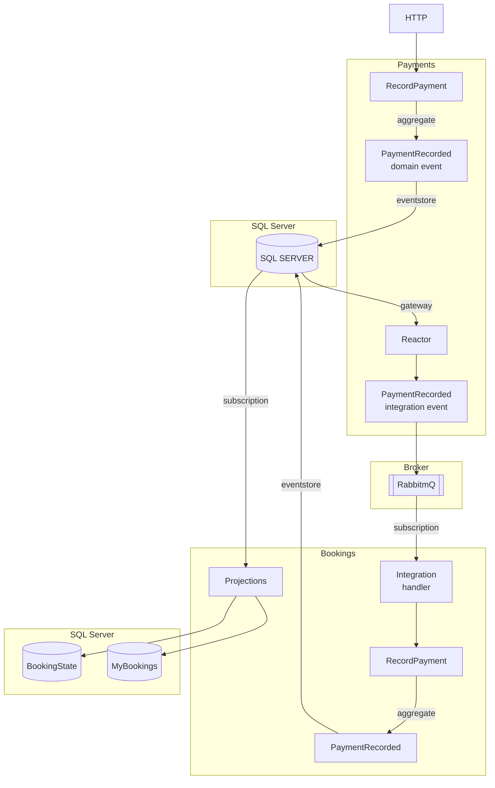

# Bookings sample application - SQL Server

This projects shows some of the features of Eventuous:

- Event-sourced domain model using `Aggregate` and `AggregateState`
- Aggregate persistence using SQL ServerQL
- Read models in SQL Server
- Integration between services using messaging (RabbitMQ)

## Usage

Start the infrastructure using Docker Compose from the repository root:

```bash
docker compose up
```

Run both `Bookings` and `Bookings.Payments` projects and then open `http://localhost:5051/swagger/index.html` and `http://localhost:5000/swagger/index.html` respectively.
Here you can use SwaggerUI to initiate commands that will result in events being raised.

### Example commands

#### Bookings -> BookRoom (`/bookings/book`)

- This command raises an event, which gets stored in the database.
- A real-time subscription triggers a projection, which adds or updates two records in SQL Server:
  - one for the booking
  - one for the guest

#### Bookings.Payments -> RecordPayment (`/recordPayment`)

- When this command is executed, it raises a `PaymentRecorded` event, which gets persisted to the database.
- A gateway inside the Payments service subscribes to this event and publishes an integration event to RabbitMQ.
- An integration RabbitMQ subscription receives the integration event and calls the Bookings service to execute the `RecordPayment` command, so it acts as a Reactor.
- When that command gets executed, it raises a `PaymentRecorded` event, which gets persisted to the database. It might also raise a `BookingFullyPaid` or `BookingOverpaid` events, depending on the amount.
- Those new events are projected to SQL Server document in the `Bookings` collection using the read-model subscription.


